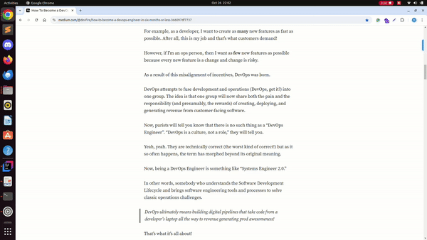

# SaveSpot

**SaveSpot** is a Chrome extension that allows users to easily highlight text on websites while reading. Whether you're browsing articles, blogs, or study materials, SaveSpot helps you mark and save important text, enhancing your reading experience. Once highlighted, your selections are saved and will be available the next time you visit the page.

## Features
- **Highlight Text**: Select any text on a webpage and highlight it with a simple right-click.
- **Unhighlight Specific Text**: Easily remove highlights by selecting the highlighted text and choosing the unhighlight option.
- **Persistent Storage**: SaveSpot remembers your highlights even if you close the browser. When you revisit the page, your highlights are restored.
- **Simple and Intuitive**: The extension integrates seamlessly with your browsing, making it easy to use without disrupting your workflow.

## Installation

1. Clone this repository or download the ZIP file.
    ```bash
    git clone https://github.com/yourusername/savespot-extension.git
    ```
2. Open Chrome and go to `chrome://extensions/`.
3. Enable **Developer mode** (toggle on the top right).
4. Click **Load unpacked** and select the folder containing the extension files.

SaveSpot should now be installed and ready to use!

## Usage

1. **Highlight Text**:
    - Navigate to any webpage and select the text you want to highlight.
    - Right-click and choose **"Highlight Selected Text"** from the context menu.
    - The selected text will be highlighted, and it will be saved for future visits to the page.

2. **Unhighlight Text**:
    - Select the highlighted text you want to remove.
    - Right-click and choose **"Remove Highlight"** from the context menu.
    - The highlight will be removed, and the change will be updated in the storage.

## Contributing

Contributions are welcome! If you have ideas for new features or improvements, please feel free to submit a pull request or open an issue. Before contributing, please make sure to:

1. Fork this repository.
2. Create a new branch for your feature/bug fix.
3. Submit a pull request detailing your changes.

## Folder Structure

Savespot/ │ ├── manifest.json # Chrome extension configuration ├── background.js # Background script for managing highlights ├── content.js # Content script for injecting into web pages ├── popup.html # Popup interface (optional) ├── popup.js # Script for managing popup interactions ├── styles.css # Basic styles (optional) └── icon/ # Icons for the extension


## Tech Stack

- **JavaScript**: Core functionality of the extension.
- **Chrome Storage API**: For persistent storage of highlighted text.
- **HTML/CSS**: For popup UI (optional).

## Future Enhancements

- **Sync Highlights Across Devices**: Using `chrome.storage.sync` to allow users to access their highlights on different devices.
- **Multiple Highlight Colors**: Allow users to choose different colors for different types of highlights.
- **Export Highlights**: Enable users to export all their highlights from a webpage as a text file.

## License

This project is licensed under the MIT License - see the [LICENSE](LICENSE) file for details.

## Demo




Feel free to reach out with any questions or feedback!

